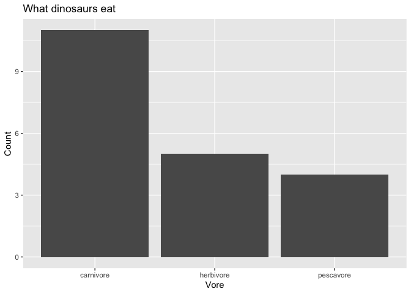

<!-- README.md is generated from README.Rmd. Please edit that file -->

# dinosaurs

<!-- badges: start -->

[](https://github.com/mine-cetinkaya-rundel/dinosaurs/actions/workflows/R-CMD-check.yaml)
<!-- badges: end -->

The goal of dinosaurs is to provide a dataset on dinosaur species.

## Installation

You can install the development version of dinosaurs from
[GitHub](https://github.com/) with:

``` r
# install.packages("devtools")
devtools::install_github("mine-cetinkaya-rundel/dinosaurs")
```

## Example

This is a basic example showing the package usage:

``` r
library(dinosaurs)
library(ggplot2)

ggplot(dinosaurs, aes(x = vore)) +
  geom_bar() +
  labs(
    title = "What dinosaurs eat",
    x = "Vore",
    y = "Count"
  )
```


