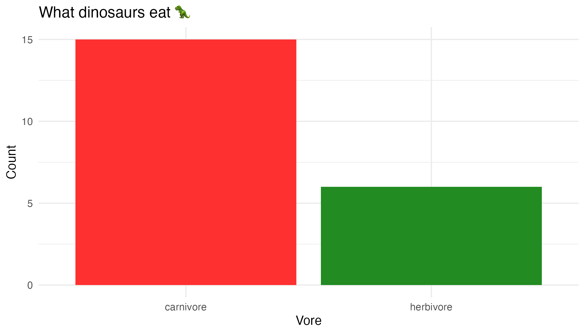

<!-- README.md is generated from README.Rmd. Please edit that file -->

# dinosaurs 🦖🦕

<!-- badges: start -->

[](https://github.com/mine-cetinkaya-rundel/dinosaurs/actions/workflows/R-CMD-check.yaml)
<!-- badges: end -->

The goal of dinosaurs is to provide a dataset on dinosaur species.

The package is currently a work in progress. We are working on
collecting more data at
<https://docs.google.com/spreadsheets/d/1Du5yUoZfhB4fKtmkrHUZq9dmYMgM5-Gda99fi3-A9eI>.

## Installation

You can install the development version of dinosaurs from
[GitHub](https://github.com/) with:

``` r
# install.packages("devtools")
devtools::install_github("mine-cetinkaya-rundel/dinosaurs")
```

## Example

This package contains the `dinosaurs` dataset which can be used to make
simple plots like the following:

``` r
library(dinosaurs)
library(ggplot2)

ggplot(dinosaurs, aes(x = vore, fill = vore)) +
geom_bar(show.legend = FALSE) +
  labs(
    title = "What dinosaurs eat 🦖",
    x = "Vore",
    y = "Count"
  ) +
  scale_fill_manual(values = c("firebrick1", "forestgreen")) +
  theme_minimal()
```


